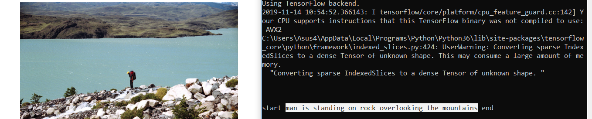

# Image Caption Generator
Image caption generator is a task that involves computer vision and natural language processing concepts to recognize the context of an image and describe them in a natural language like English.

## Image Caption Generator with CNN
The objective of the project is to build a working model of Image caption generator by implementing CNN with LSTM.

The image features will be extracted from Xception which is a CNN model trained on the Imagenet dataset and then fed into the LSTM model which will be responsible for generating the image captions.

For the image caption generator, I will be using the Flickr_8K dataset which can be downloaded here:
[Flicker8k_Dataset](https://github.com/jbrownlee/Datasets/releases/download/Flickr8k/Flickr8k_Dataset.zip) and
[Flickr_8k_text](https://github.com/jbrownlee/Datasets/releases/download/Flickr8k/Flickr8k_text.zip) 

The Flickr_8k_text folder contains file Flickr8k.token which is the main file of the dataset that contains image name and their respective captions separated by newline(“\n”).

## Pre-requisites
Following libraries are needed to run the code:
1. pip install tensorflow
2. keras
3. pillow
4. numpy
5. tqdm
6. jupyterlab

## Image Caption Generator Model
To make the image caption generator model, a CNN-RNN model is implemented.

1. CNN is used for extracting features from the image. We will use the pre-trained model Xception.
2. LSTM will use the information from CNN to help generate a description of the image.

## Testing the model
After the model has been trained, testing_caption_generator.py will load the model and generate predictions.
To test:
1. Clone the repository to a local folder
2. Activate a virtual environment
3. Install all pre-requisites
4. Copy a test image inside the cloned repository
4. Type python testing_caption_generator.py --image "image_name_with_extension" on CMD or any Python prompt
5. The caption for the image is generated

## Example output

